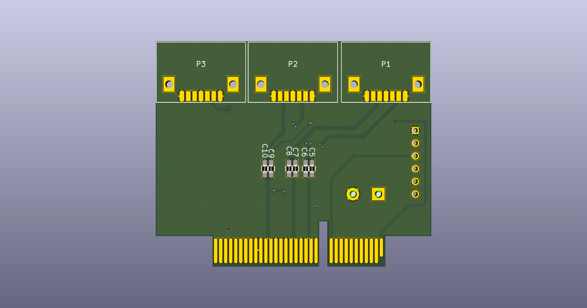

# PCIe Injector

### PCIe
PCIe is the main high speed way of communicating between a processor and its peripherials. It is used in PC (also encapsulated in Thunderbolt) and now even in mobile phones.
Doing security research on a PCIe system is complex because it requires expensive tools (>$50k) and such tools are not that common when packet generation is needed.

### Featuring:
* 1. XC7A50T Xilinx Serie 7 FPGA
* 2. FT601 FTDI USB 3.0
* 3. MT41K256 4Gb DDR3 DRAM
* 4. 4 High speed lane for up to PCIe 4x emulation

### History
Currently, only few attacks were made on PCIe devices. Most of them were done using a Microblaze inside a Xilinx FPGA to send/receive the TLPs, making it hard to really analyze. (Using embedded C software to generate/analyze traffic) An other way is to use USB3380 chip, but it is also not flexible enough (only supporting 32bits addressing) and does not allow debugging the PCIe state machine.

## Principle

The PCIe injector is based on a Series 7 Xilinx FPGA connected to a DDR3 and a high speed USB 3.0 FT601 chip from FTDI.

It allows:
* 1. Having a full control of the PCIe core.
* 2. Sending/Receiving TLPs through USB 3.0 (or bufferize it to/from DDR3)
* 3. Using flexible software/tools on the Host for receiving/generating/analyzing the TLPs. (Wireshark dissectors, scapy, ...)

The board connects to daughter boards over SATA cable. Good signal integrity is mandatory when doing PCIe and SATA cable are the cheapest way to achieve that.

