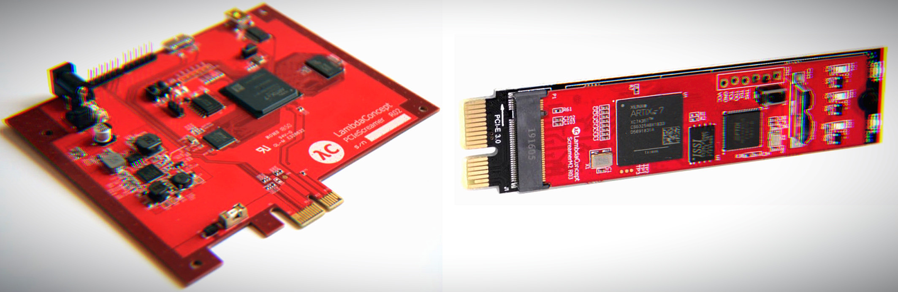

```
                        ___  _________    ____
                       / _ \/ ___/  _/__ / __/__________ ___ ___ _  ___ ____
                      / ___/ /___/ // -_)\ \/ __/ __/ -_) _ `/  ' \/ -_) __/
                     /_/   \___/___/\__/___/\__/_/  \__/\_,_/_/_/_/\__/_/

                             Copyright (c) 2016-2020, EnjoyDigital
                             Copyright (c) 2016-2020, Lambdaconcept
                                Powered by Migen & LiteX
```

# PCIe Screamer - TLPs experiments...



## Introduction
The PCIe bus is now heavily used to interconnect chips in computers and embedded devices. Tools to interact with the PCIe bus can be very expensive (>$50k)
and often limited when doing security research. The PCIe Screamer aims to offer an alternative for that at a reasonable price.

## Architecture
The PCIe Screamer is based on a Xilinx Artix7 FPGA with PCIe and USB3.0 interfaces:
- Xilinx Artix7 XC7A35T FPGA
- FT601 FTDI USB 3.0
- PCIe Gen2 X1 or X4 (M2)

## Example design
A example design build with Migen and LiteX is provided and allow:
- Redirecting PCIe TLP requests to the Host, using the Host to analyze/generate the TLP completion and sending it to the PCIe bus.
- Generating PCIe TLP requests generated from the Host and redirecting the TLP completions to the Host.

### Getting started
```sh
$ wget https://raw.githubusercontent.com/enjoy-digital/litex/master/litex_setup.py
$ chmod +x litex_setup.py
$ ./litex_setup.py init
$ sudo ./litex_setup.py install
```

### Build the FPGA bitstream
```sh
$ ./pcie_screamer.py --build
```

### Load the FPGA bitstream
```sh
$ ./pcie_screamer.py --load
```

## Software support
The Gateware/Software in this repository is just a proof of concept that has been done to evaluate and check the feasability of a low cost PCIe
board/tool for security research.PCIe Screamer is well supported by [PCIe Leech](https://github.com/ufrisk/pcileech) and it is recommended to use it.

## Get one
The PCIe Screamer is available at: https://shop.lambdaconcept.com/
