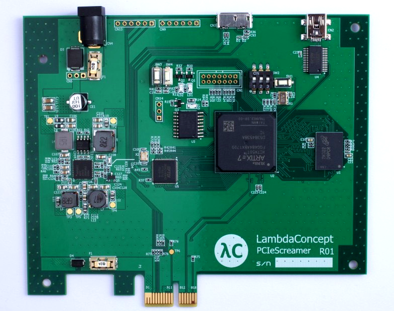
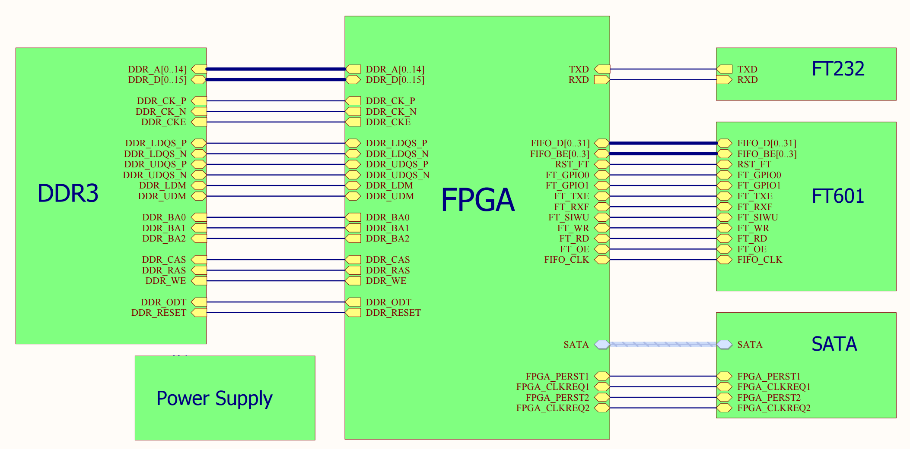

# PCIe Injector


## PCIe
The PCIe bus is now the main high speed communication bus between a processor and its peripherials. It is used in all PC (sometime encapsulated in Thunderbolt) and now even in mobile phones.
Doing security research on PCIe systems can requires very expensive tools (>$50k) and packet generaration for such tools is not
a common feature. PCIe Injector provides a such tool at a more reasonable price.



## Board
- Xilinx Artix7 XC7A50T FPGA
- FT601 FTDI USB 3.0
- MT41K256 4Gb DDR3 DRAM
- PCIe Gen2 X1




## History
Currently, only few attacks were made on PCIe devices. Most of them were done using a Microblaze inside a Xilinx FPGA to send/receive the TLPs, making it hard to really analyze. (Using embedded C software to generate/analyze traffic) An other way is to use USB3380 chip, but it is also not flexible enough (only supporting 32bits addressing) and does not allow debugging the PCIe state machine.

## Principle

The PCIe injector is based on a Artix7 FPGA from Xilinx connected to a DDR3 and a high speed USB 3.0 FT601 chip from FTDI.

It allows:
- Having a full control of the PCIe core.
- Sending/Receiving TLPs through USB 3.0 (or bufferize it to/from DDR3)
- Using flexible software/tools on the Host for receiving/generating/analyzing the TLPs. (Wireshark dissectors, scapy, ...)

## Getting started

1. Install Python3 and Xilinx's Vivado software.

2. Obtain LiteX and install it:
```bash
git clone https://github.com/enjoy-digital/litex --recursive
cd litex
python3 setup.py install
cd ..
 ```

3. Build:
```bash
python3 pcie_injector.py
  ```

4. Flash design:
```bash
python3 flash.py
```
